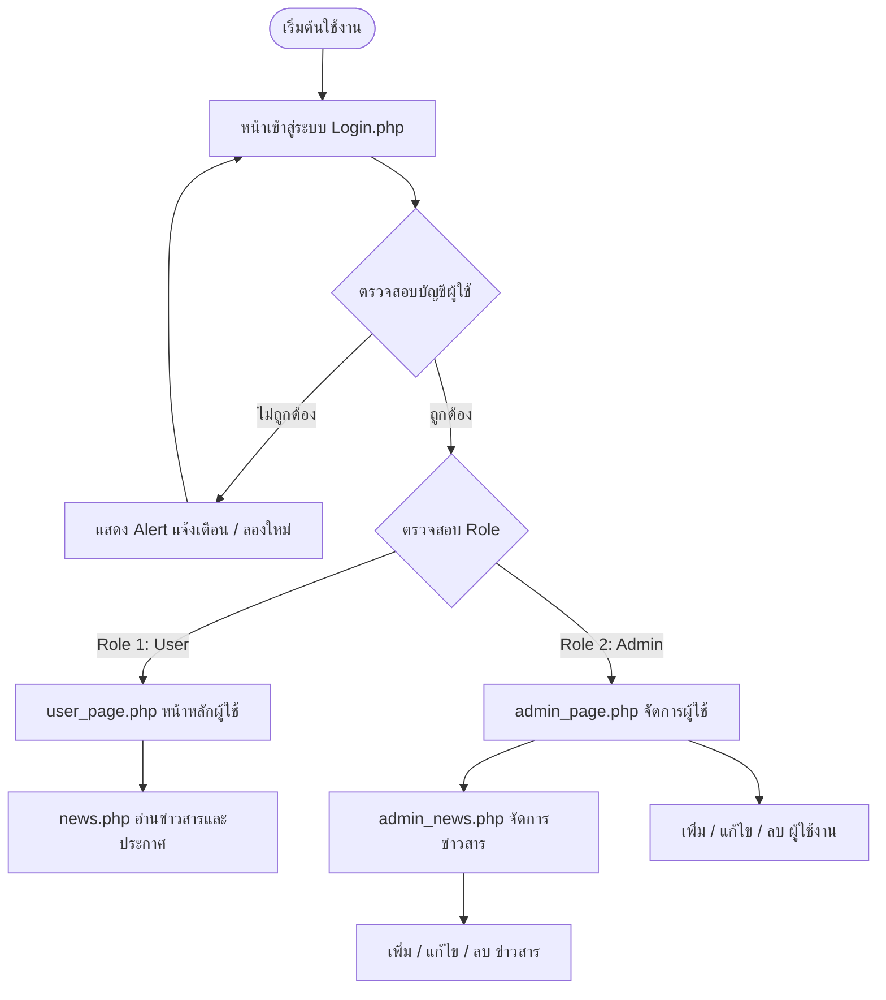
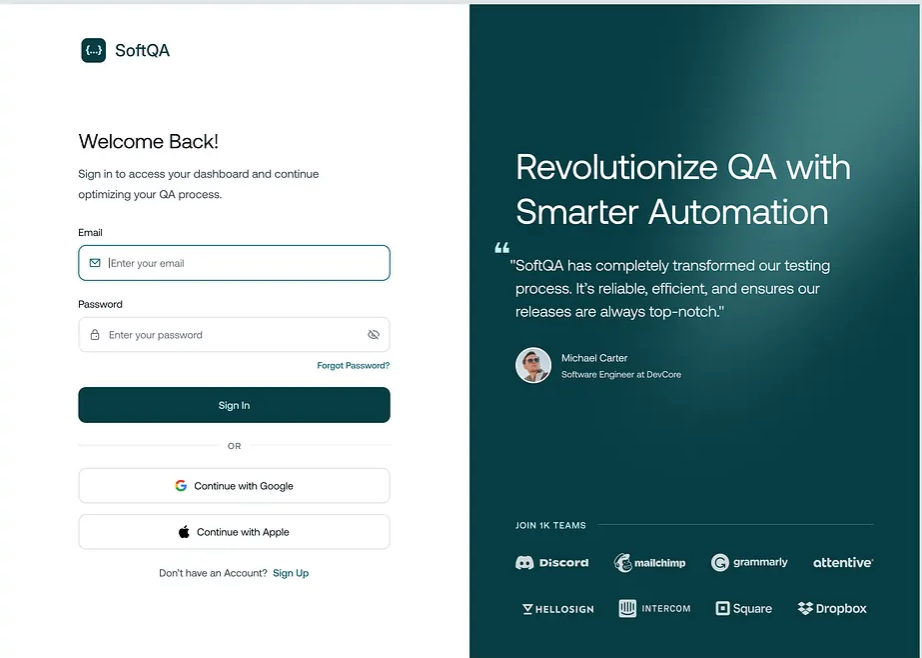

# 🏛️ Sukhothai Provincial Information & News Management System
> **ระบบเว็บไซต์ประชาสัมพันธ์และบริหารจัดการข่าวสารจังหวัดสุโขทัย**

[](https://www.php.net/)
[](https://www.mysql.com/)
[](https://developer.mozilla.org/en-US/docs/Web/HTML)
[](https://developer.mozilla.org/en-US/docs/Web/CSS)
[](https://www.apachefriends.org/)

---

## 📌 เกี่ยวกับโปรเจกต์ (About The Project)

**ระบบเว็บไซต์ประชาสัมพันธ์และบริหารจัดการข่าวสารจังหวัดสุโขทัย** พัฒนาขึ้นเพื่อเป็นศูนย์กลางข้อมูลการประชาสัมพันธ์ของจังหวัดสุโขทัย นำเสนอข้อมูลประวัติความเป็นมา มรดกโลกทางวัฒนธรรม แหล่งท่องเที่ยวสำคัญ และศูนย์บริการประชาชน พร้อมทั้งมีระบบหลังบ้าน (Admin Control Panel) สำหรับผู้ดูแลระบบในการบริหารจัดการสิทธิ์ผู้ใช้งานและเผยแพร่ข่าวสาร/ประกาศอย่างเป็นทางการ

---

## ✨ ฟีเจอร์หลัก (Key Features)

### 👤 ฝั่งผู้ใช้งานทั่วไป (Public / User View)
- 🏛️ **ข้อมูลเกี่ยวกับจังหวัด (About Sukhothai):** แสดงประวัติและข้อมูลมรดกโลก UNESCO "รุ่งอรุณแห่งความสุข"
- 🖼️ **แกลเลอรีท่องเที่ยว (Attractions Gallery):** แสดงภาพสถานที่ท่องเที่ยวสำคัญ เช่น อุทยานประวัติศาสตร์ วัดมหาธาตุ วัดศรีชุม
- 🏢 **ศูนย์บริการประชาชน (Public Services):** รวบรวมช่องทางการติดต่อหน่วยงานราชการ ศาลากลาง ศูนย์ดำรงธรรม (1567) และงานทะเบียน
- 📰 **ระบบข่าวสารและประกาศ (News & Announcements):** อ่านข่าวสารล่าสุดจากจังหวัด พร้อมระบบจัดรูปแบบวันที่ภาษาไทย (พ.ศ.)

### 🛡️ ฝั่งผู้ดูแลระบบ (Admin Control Panel)
- 🔐 **ระบบเข้าสู่ระบบและสมัครสมาชิก (Authentication):** ตรวจสอบสิทธิ์และจำแนกผู้ใช้ (Role 1 = User, Role 2 = Admin)
- 👥 **ระบบจัดการผู้ใช้ (User Management - CRUD):**
  - เพิ่มผู้ใช้งานใหม่ สามารถกำหนดสิทธิ์ (User/Admin) ได้
  - แก้ไขข้อมูล Username, Password และ Role
  - ลบผู้ใช้งาน (พร้อมระบบป้องกัน **"แอดมินลบไม่ได้"** เพื่อความปลอดภัย)
- 📝 **ระบบจัดการข่าวสาร (News Management - CRUD):**
  - ประกาศข่าวสารใหม่ (หัวข้อ + เนื้อหา)
  - แสดงรายการข่าวในรูปแบบตาราง พร้อมตัดย่อเนื้อหาอัตโนมัติ
  - แก้ไข และลบข่าวสาร พร้อมป๊อบอัปยืนยันการลบ

---

## 🛠️ เทคโนโลยีที่ใช้ (Tech Stack)

- **Backend:** Native PHP 8.x
- **Database:** MySQL / MariaDB (ใช้ไดรเวอร์ `mysqli`)
- **Frontend:** HTML5, Vanilla CSS3, Google Fonts (`Mitr`)
- **Server Environment:** Apache Server via XAMPP
- **Database Tool:** phpMyAdmin

---

## 📊 ผังการทำงานของระบบ (System Workflow)



---

## 🗄️ โครงสร้างฐานข้อมูล (Database Schema)

### 1. ตาราง `users` (ข้อมูลผู้ใช้งาน)
| Column Name | Data Type | Constraints | Description |
| :--- | :--- | :--- | :--- |
| `id` | INT | PRIMARY KEY, AUTO_INCREMENT | รหัสผู้ใช้งาน |
| `username` | VARCHAR(50) | UNIQUE, NOT NULL | ชื่อผู้ใช้สำหรับ Login |
| `password` | VARCHAR(255) | NOT NULL | รหัสผ่าน |
| `role` | TINYINT(1) | DEFAULT 1 | สิทธิ์ใช้งาน (`1` = User, `2` = Admin) |
| `created_at` | TIMESTAMP | DEFAULT CURRENT_TIMESTAMP | วันเวลาที่สร้างบัญชี |

### 2. ตาราง `news` (ข่าวสารและประกาศ)
| Column Name | Data Type | Constraints | Description |
| :--- | :--- | :--- | :--- |
| `id` | INT(6) | PRIMARY KEY, AUTO_INCREMENT | รหัสข่าวสาร |
| `title` | VARCHAR(255) | NOT NULL | หัวข้อข่าวสาร |
| `content` | TEXT | NOT NULL | เนื้อหาข่าวสาร |
| `created_at` | TIMESTAMP | DEFAULT CURRENT_TIMESTAMP | วันเวลาที่สร้าง/แก้ไขข่าว |

---

## 📂 โครงสร้างโฟลเดอร์โปรเจกต์ (Project Structure)

```
YoPJ/
├── images/                   # ไดเรกทอรีเก็บรูปภาพสถานที่ท่องเที่ยว
│   ├── 1.png
│   ├── 2.png
│   └── ...
├── Homepage.css              # สไตล์ชีตสำหรับหน้าหลักและหน้า Admin
├── loginsy.css               # สไตล์ชีตสำหรับหน้า Login
├── reg.css                   # สไตล์ชีตสำหรับหน้า Register
├── fonts.css                 # สไตล์ชีตจัดการฟอนต์
├── connet.php                # ไฟล์เชื่อมต่อฐานข้อมูล MySQL
├── Login.php                 # หน้าฟอร์ม Login
├── Loginprocess.php          # ประมวลผลการ Login & ตรวจสอบ Role
├── register.php              # หน้าฟอร์ม สมัครสมาชิก
├── registerprocess.php       # ประมวลผลการบันทึกผู้ใช้ใหม่
├── user_page.php             # หน้าหลักสำหรับ User (ประชาสัมพันธ์)
├── news.php                  # หน้าข่าวสารสำหรับประชาชนทั่วไป
├── admin_page.php            # หน้า Admin จัดการสิทธิ์และผู้ใช้ (CRUD Users)
├── admin_news.php            # หน้า Admin จัดการข่าวสาร (CRUD News)
├── sukhotthi.sql             # ไฟล์ Database SQL Dump
└── README.md                 # เอกสารอธิบายโปรเจกต์
```

---

## 🚀 ขั้นตอนการติดตั้งและรันใช้งาน (Installation & Setup)

1. **ดาวน์โหลดและติดตั้ง XAMPP** (หากยังไม่มีในเครื่อง)
   - เปิดใช้งาน **Apache** และ **MySQL** บน XAMPP Control Panel

2. **คัดลอกโฟลเดอร์โปรเจกต์**
   - นำโฟลเดอร์โปรเจกต์ไปวางที่ `C:\xampp\htdocs\YoPJ\YoPJ`

3. **นำเข้าฐานข้อมูล (Import Database)**
   - เปิดเว็บเบราว์เซอร์ไปที่ `http://localhost/phpmyadmin/`
   - สร้างฐานข้อมูลใหม่ชื่อ `sukhotthi` (Collation: `utf8mb4_general_ci`)
   - เลือกเมนู **Import** แล้วเลือกไฟล์ `sukhotthi.sql` จากในโปรเจกต์เพื่อนำเข้าตารางข้อมูล

4. **เข้าใช้งานระบบ (Run Project)**
   - เปิดเบราว์เซอร์แล้วเข้า URL: `http://localhost/YoPJ/YoPJ/Login.php`
   - **บัญชีผู้ใช้เริ่มต้นสำหรับ Admin:**
     - **Username:** `Admin`
     - **Password:** `Admin`

---

## 📷 ภาพรวมหน้าตาโปรแกรม (Screenshots)

| หน้าเข้าสู่ระบบ (Login) | หน้าหลักประชาสัมพันธ์ (User Page) |
| :---: | :---: |
|  |  |

---

## 👨‍💻 ผู้พัฒนา (Developer)

- **Project:** Sukhothai Provincial Information & News Management System
- **Repository:** Private / Public GitHub Repository

---
*จัดทำขึ้นสำหรับการนำเสนอผลงานและใส่ใน Portfolio / Resume*
